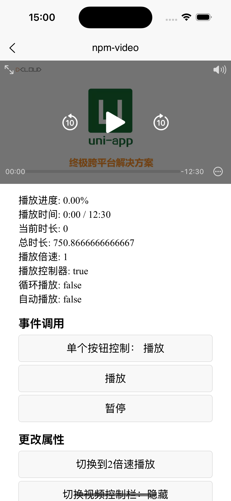

# `uniapp-video-player` —— 基于 HTML5 video 标签开发出来，适用于 uni-app 的高自由度视频播放器（仅支持App-vue）


 

## 🎯 组件特性
- ✅ 突破uni-app原生视频组件的层级限制
- ✅ 完美兼容 swiper/scroll-view
- ✅ 支持 Vue2/Vue3 双版本
- ✅ 支持 iOS/Android 双系统适配
- ✅ 支持自定义播放按钮、进度条、全屏按钮等

## 📦 快速开始

### 安装方式
```bash
npm i uniapp-video-player
```

### 基础使用
```html
<DomVideoPlayer
  src="https://www.w3school.com.cn/i/movie.mp4"
  autoplay
  controls
/>

<script>
import DomVideoPlayer from 'uniapp-video-player'
export default {
  components: {
    DomVideoPlayer
  }
}
</script>
```

## 🔧 组件配置

### 属性说明

| 属性名 | 类型 | 默认值 | 说明 |
|--------------|---------|----------|-------------------------------|
| src | String | - | 必填 视频地址 | 
| autoplay | Boolean | false | 是否自动播放 | 
| controls | Boolean | false | 是否显示原生控制条 |
| controlsList | String | '' | nodownload/nofullscreen/noremoteplayback |
| loop | Boolean | false | 是否循环播放 |
| muted | Boolean | false | 是否静音播放 |
| objectFit | String | 'contain'| 视频填充模式 (contain/cover) |
| poster | String | - | 视频封面图地址 |
| isLoading | Boolean | false | 遮挡安卓默认黑色播放按钮 |
| isLog | Boolean | true | 是否打印组件日志 |

### 事件列表
| 事件名 | 类型 | 说明 | 回调参数 |
|------------------|---------|----------|----------------|
| play | 无 | 开始播放事件 | - |
| pause | 无 | 暂停播放事件 | - |
| ended | 无 | 播放结束事件 | - |
| timeupdate | Number | 播放进度更新 | currentTime|
| durationchange | Number | 视频总时长改变事件 | duration|
| ratechange | Number | 视频速率改变事件 | playbackRate|
| fullscreenchange | Boolean | 全屏状态改变事件 | fullscreen|
| canplay | 无 | 视频可以播放事件 | - |
| video-click | 无 | 视频被点击事件 | - |

### 组件数据
| 数据名 | 类型 | 说明 |
|--------------|---------|----------|
| currentTime | Number | 当前播放时间 |
| duration | Number | 视频总时长 |
| playing | Boolean | 是否正在播放 |

### 方法列表
| 方法名 | 说明 | 参数 |
|--------------|--------------|------------|
| play | 播放 | - |
| pause | 暂停 | - |
| remove | 移除视频 | - |
| fullScreen | 进入全屏 | - |
| toSeek | 跳转到指定时间点(秒) | time: Number |
| remove | 移除视频 | - |

### 使用案例
```javascript
methods: {
  // 父组件对 video 的 methods 调用案例
  play() {
    const videoPlayer = this.$refs.domVideoPlayer
    videoPlayer.play()
  },
  // 父组件对 video 的 data 数据获取案例
  getCurrentTime() {
    const videoPlayer = this.$refs.domVideoPlayer
    console.log(videoPlayer.currentTime)
  }
}
```

### 示例下载

> 如果不想看文档，可直接下载代码使用示例，本组件已上架 `DCloud插件市场`，前往插件市场[下载代码示例](https://ext.dcloud.net.cn/plugin?id=19654)


## 📸 效果预览
<div align="center">
  
</div>


## 💖 致谢与支持

### 特别感谢
> 插件上线 [DCloud插件市场](https://ext.dcloud.net.cn/plugin?id=19654) 以来，大家好评如潮，感谢各位开发者的支持和打赏！也收到了许多的技术咨询和私信，非常感谢大家的认可！

### 项目求赞
如果本组件对您有帮助，请不要吝啬您的鼓励：
- [👉 DCloud插件市场五星好评](https://ext.dcloud.net.cn/plugin?id=xxxxx)
- [⭐ GitHub 给个星星⭐️](https://github.com/liusheng22/uniapp-video-player)


## 📞 技术支持

> 如遇使用问题或需要定制开发，可通过以下方式联系作者：

- 微信：`18727863210`
- 邮箱：`black.liusheng@gmail.com`
